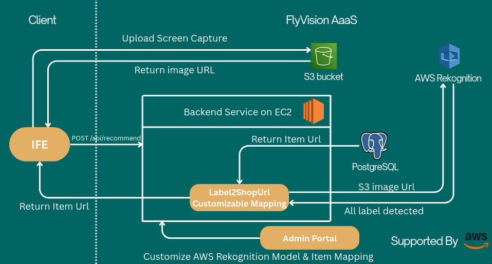

# FlyVision AaaS

## Prerequisites

- Python 3.9+
- uv package manager
- AWS account with necessary permissions (S3, Rekognition, EC2)

## Deployment Instructions

1. Clone the repository to your local machine.

### S3 Bucket Setup

1. Log in to AWS Console
    → Go to https://console.aws.amazon.com
2. Open S3 Service
    Search for S3 in the search bar → Click S3
3. Create a New Bucket
    - Click Create bucket
    - Bucket name: Choose a globally unique name (e.g., my-unique-app-data-2025)
    - Region: Select your preferred region (e.g., us-east-1)
    - Leave other defaults (or adjust as needed)

4. Create the Bucket
    - Click Create bucket

### EC2 Instance Setup

1. Go to the [AWS EC2 Console](https://console.aws.amazon.com/ec2/).
2. Click Launch Instance
3. Choose an AMI (e.g., Amazon Linux 2 or Ubuntu Server 22.04).
4. Select instance type (e.g., `t2.micro` for free tier).
5. Configure:
   - Keep default VPC and subnet.
   - Enable Auto-assign Public IP (important!).
6. Add storage (default is fine).
7. Security Group:
   - Create a new security group or select existing.
   - Edit Inbound Rules
   - Add rule: port 8000 → Source: `0.0.0.0/0`.
8. Launch and download the .pem key pair.

### Frontend Setup

1. Navigate to the `frontend_flask` directory.
2. `uv sync` to install dependencies.
3. Copy the example environment file and update with your AWS credentials: `cp .env.example .env`
4. Edit `.env` and set your AWS credentials.
5. `uv run app.py` to start the Flask server.

### Backend Setup

1. Navigate to the `saas` directory.
2. `uv sync` to install dependencies.
3. Copy the example environment file and update with your AWS credentials: `cp .env.example .env`
4. Edit `.env` and set your AWS credentials.
5. `uv run python manage.py runserver`

## Architecture

